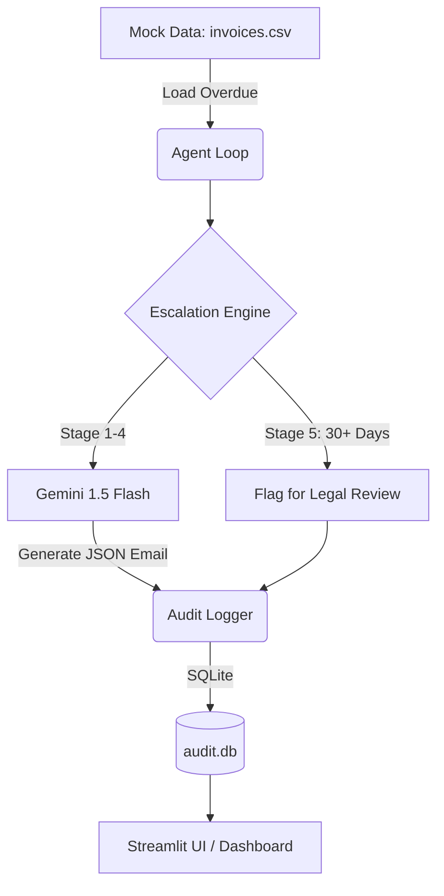

# Finance Credit Follow-Up Email Agent

An AI-powered payment reminder engine that automates collections and intelligently escalates email tone based on overdue status.

## 📌 Project Overview
This project is a prototype for the AI Enablement Internship (Task 2). It assists the Finance team by automatically generating and logging follow-up emails for pending credit/invoice payments. The agent varies the tone and urgency of each follow-up based on the number of days overdue, starting warmly and escalating progressively to a final legal review flag.

## 🚀 Setup Instructions

1. **Set up a Virtual Environment (Recommended):**
   ```bash
   python -m venv venv
   # On Windows:
   venv\Scripts\activate
   # On Mac/Linux:
   source venv/bin/activate
   ```
2. **Install Dependencies:**
   ```bash
   pip install -r requirements.txt
   ```
3. **Environment Variables:**
   - Ensure your `.env` file has the Gemini API key set: `GEMINI_API_KEY=your_api_key_here`
4. **Run the Dashboard:**
   ```bash
   streamlit run app.py
   ```

## 🧠 Agent Architecture



## 🛠 Technical Stack & Decision Log

### 1. LLM Chosen
- **Model:** `models/gemini-2.5-flash` (Google)
- **Rationale:** Chosen for its speed, native JSON structured output support, and generous free tier. The context window is more than sufficient for generating short emails, and its instruction-following capabilities ensure accurate tone matching without the higher cost of models like GPT-4o or Claude 3.5 Sonnet.

### 2. Agent Framework
- **Framework:** Custom Python orchestration using `google-generativeai` SDK.
- **Architecture:** We used a Plan-and-Execute-style loop. A deterministic rule-based engine (`escalation.py`) classifies the overdue stage, and an LLM generation layer (`email_generator.py`) creates the personalised message. This hybrid approach ensures consistent policy adherence (escalation paths) while leveraging the LLM's natural language generation.
- **Rate-limit optimizations:** The agent reuses previously generated emails from the SQLite audit log when the invoice stage has not changed, reducing repeated Gemini calls. It also includes retry/backoff handling for 429 quota errors and fallback support for lower-tier Gemini models if the primary model hits quota limits.

### 3. Prompt Design
- **System Prompt:** Set to establish persona ("professional Finance Collections Assistant for a B2B company in India") and enforce strict JSON output formatting.
- **Guardrails:** Explicitly instructed to *only* use provided data, never invent figures, output strictly JSON, and omit markdown outside the JSON block.

## 🔒 Security Risk Mitigation

| Risk | Description | Mitigation Strategy Implemented |
|---|---|---|
| **Prompt Injection** | Malicious input manipulating agent behavior | Inputs (client names, companies) are safely interpolated into prompt templates. The agent outputs strictly structured JSON (enforced via generation config), making arbitrary code execution or prompt leakage highly unlikely. |
| **Data Privacy / PII** | Resume/email data contains personal info | In this prototype, mock data is used. For production, the database uses local SQLite processing. The LLM only receives essential context (name, amount, dates) without full historical payment data. |
| **API Key Exposure** | LLM/email API keys leaked in code | API keys are stored in a `.env` file loaded via `python-dotenv`. The `.env` file is excluded from version control via `.gitignore`. |
| **Hallucination Risk** | LLM generating false scores or wrong email content | Minimized using a low temperature (`0.3`) and strict JSON schema generation. The prompt strictly prohibits inventing figures. A deterministic routing step handles escalation logic, so the LLM doesn't calculate the days overdue itself. |
| **Unauthorised Access** | Anyone triggering the agent endpoint | Streamlit dashboard runs locally. In a production environment, OAuth or API key authentication would be wrapped around the endpoint. |
| **Email Spoofing** | Emails appearing from wrong sender | The prototype operates in a **Dry-Run Mode**. Emails are logged to SQLite and shown in the UI but not actually dispatched, eliminating the risk of accidental spoofing or spam during testing. |
